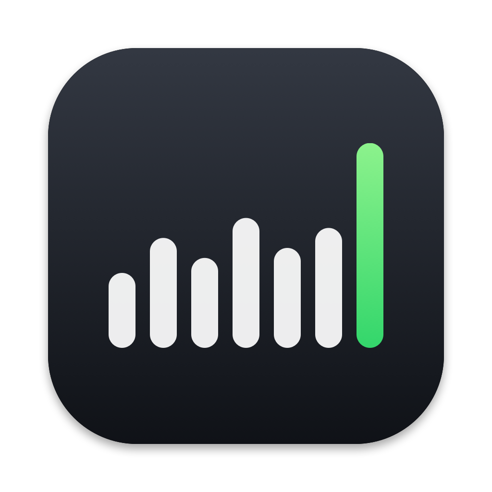
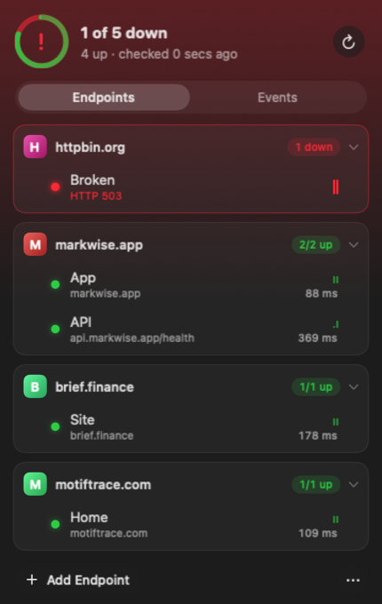

<p align="center"></p>

<h1 align="center">Upbar</h1>

<p align="center">Uptime checks in your macOS menu bar.</p>

<p align="center">
  <a href="https://github.com/josephgoksu/upbar/releases/latest"></a>
  <a href="https://github.com/josephgoksu/upbar/actions/workflows/ci.yml"></a>
  
  <a href="LICENSE"></a>
</p>

<p align="center"></p>

## 1. General

Upbar is a macOS menu bar app. It monitors the HTTP endpoints that you add. Upbar sends a notification when an endpoint goes down. It sends a notification when the endpoint is up again.

Features:

- The menu bar icon shows the response times of the last 7 checks.
- Each endpoint shows the response times of its last 30 checks.
- You can set the HTTP status code that each endpoint must return.
- Upbar shows the uptime and the p50, p95 and p99 response times of the last 24 hours. A chart shows the response times.
- Upbar uses a small quantity of memory, CPU and network. Refer to [section 6](#6-resource-use).
- Upbar does not collect data. Refer to [section 7](#7-privacy).
- Upbar can receive events from your deploys, CI jobs and scripts. Refer to [section 9](#9-events).
- The source code is two Swift files. It has no dependencies.

## 2. Requirements

| Item | Requirement |
|---|---|
| Operating system | macOS 14 (Sonoma) or later |
| Processor | Apple silicon or Intel |
| Permissions | No administrator password is necessary |

## 3. Installation

### 3.1 Install with Terminal (recommended)

1. Open the Terminal app.
2. Type this command:

   ```sh
   curl -fsSL https://raw.githubusercontent.com/josephgoksu/upbar/main/install.sh | sh
   ```

3. Push the Return key.

Result: Upbar is in `~/Applications`. The Upbar icon shows in the menu bar.

> [!NOTE]
> The script does not use `sudo`. It compares the download with a SHA-256 checksum before it installs the app.

### 3.2 Install from a browser download

1. Download `Upbar.zip` from the [latest release](https://github.com/josephgoksu/upbar/releases/latest).
2. Open `Upbar.zip`.
3. Move `Upbar.app` to the Applications folder.
4. Right-click `Upbar.app`, then select **Open**.
5. In the dialog box, click **Open**.

> [!NOTE]
> Do steps 4 and 5 one time only. Apple does not notarize Upbar at this time. Thus, macOS blocks the first start of an app that you download with a browser.

### 3.3 Allow notifications

When Upbar starts for the first time, macOS shows a notification request.

1. In the request, click **Allow**.

## 4. Operation

### 4.1 Open the Upbar window

1. Click the Upbar icon in the menu bar.

### 4.2 Add an endpoint

1. Open the Upbar window.
2. Click **+ Add Endpoint**. The keyboard shortcut is ⌘N.
3. In the **URL** field, type or paste the URL of the endpoint.
4. Optional: In the **Name** field, type a name. If you do not type a name, Upbar uses the host name.
5. Optional: In the **Expect** field, type the HTTP status code that the endpoint must return. The default is 200.
6. Optional: Click **Test now**. The result shows the status code and the response time.
7. Click **Save**. The keyboard shortcut is the Return key.

Result: Upbar checks the endpoint immediately. Then it checks the endpoint every 60 seconds.

> [!NOTE]
> If the URL does not start with `http://` or `https://`, Upbar adds `https://`.

### 4.3 Edit an endpoint

1. Open the Upbar window.
2. Move the pointer onto the endpoint.
3. Click the pencil icon. Alternatively, right-click the endpoint, then select **Edit**.
4. Change the URL, the name or the expected status code.
5. Click **Save**.

When the editor opens, Upbar tests the endpoint. The **Test** row shows the result. The **Last 24 hours** section shows the uptime, the p50, p95 and p99 response times, and the number of checks. A chart shows the response time. Red lines show failed checks.

> [!NOTE]
> If you change only the name, Upbar keeps the check history. If you change the URL or the expected status code, Upbar removes the check history.

### 4.4 Delete an endpoint

> [!CAUTION]
> You cannot undo this procedure.

1. Open the Upbar window.
2. Move the pointer onto the endpoint.
3. Click the pencil icon.
4. Click **Delete Endpoint**.
5. Click **Click Again to Delete**.

Alternatively, right-click the endpoint, then select **Delete**.

### 4.5 Fold a website

Upbar groups the endpoints by website. For example, `api.markwise.app` and `markwise.app` are in the group **markwise.app**.

1. Open the Upbar window.
2. Click the name of the website.

Result: Upbar hides the endpoints of that website. Click the name again to show them.

### 4.6 Check all endpoints now

1. Open the Upbar window.
2. Click the arrow icon at the top right. The keyboard shortcut is ⌘R.

### 4.7 Open an endpoint in the browser

1. Open the Upbar window.
2. Click the endpoint.

### 4.8 Start Upbar when you log in

1. Open the Upbar window.
2. Click the **⋯** icon at the bottom right.
3. Select **Open at Login**.

### 4.9 Stop Upbar

1. Open the Upbar window.
2. Click the **⋯** icon at the bottom right.
3. Select **Quit Upbar**.

## 5. Indications

### 5.1 Menu bar icon

| Indication | Meaning |
|---|---|
| 7 bars in the menu bar color | All endpoints are up. The height of a bar shows the median response time of one check. |
| An orange bar | A check failed during that minute. No endpoint is down now. |
| Red bars and a number | The number shows how many endpoints are down. |
| Gray dots | Upbar has not completed 7 checks since it started. |

### 5.2 Endpoint status

| Indication | Meaning |
|---|---|
| Website name and green **2/2 up** | All endpoints of the website are up. |
| Website name and gray **1/2 up** | Upbar has not completed the checks of 1 endpoint. |
| Website name and red **1 down** | 1 endpoint of the website is down. Upbar shows this website first. |
| Green dot | The endpoint is up. |
| Red dot and red text | The endpoint is down. The text shows the cause and the time since the endpoint went down. |
| Gray dot | Upbar has not checked the endpoint yet. |
| Orange response time | The response time is more than 1 second. |
| Red bar in the history | One check failed. |

### 5.3 Window header

| Indication | Meaning |
|---|---|
| Green ring and **All systems up** | All endpoints are up. The ring shows the part of the endpoints that are up. |
| Red tint and **2 of 6 down** | 2 endpoints are down. The green part of the ring shows the endpoints that are up. |
| **Offline** | The Mac has no network connection. Upbar stops all checks until the connection is available again. |

## 6. Resource use

These values are from a Mac with 10 endpoints.

| Resource | Value |
|---|---|
| Memory | Approximately 20 MB |
| CPU, between checks | 0% |
| Network, each minute | Approximately 60 KB for 10 endpoints |

Upbar decreases resource use in these ways:

- Each check is a `HEAD` request. Thus, the server does not send the page body.
- Upbar uses the same connection again for the next check.
- Upbar does not keep a cache or cookies.
- Upbar stops all checks while the Mac is offline.
- macOS can move a check by up to 10 seconds. This lets macOS do the check together with other tasks.

## 7. Privacy

- Upbar does not collect data.
- Upbar sends requests only to the endpoints that you add.
- Upbar keeps the list of endpoints on your Mac, in the `com.josephgoksu.upbar` preferences.
- Upbar keeps the check results of the last 24 hours in `~/Library/Application Support/Upbar/history.plist`. Each check result is a time and a response time. Upbar deletes results that are older than 24 hours.
- Upbar does not keep cookies, a cache or the response bodies.
- Events go directly from the sender to your Mac. Upbar keeps them only in memory. The receiver token is in the Keychain.

## 8. How Upbar checks an endpoint

1. Every 60 seconds, Upbar sends a `HEAD` request to each endpoint.
2. If the status code is the expected status code, the endpoint is up.
3. If the status code is different, Upbar sends a `GET` request. Upbar stops the request after it receives the headers.
4. If the status code of the `GET` request is different, the check fails.
5. After 2 failed checks in sequence, the endpoint is down. Upbar sends a notification.
6. When a check of a down endpoint is successful, the endpoint is up. Upbar sends a notification.

Statistics:

- The uptime is the percentage of successful checks in the last 24 hours.
- p50, p95 and p99 use the nearest-rank method. They use only successful checks.
- Upbar writes the check results to disk every 10 minutes and when it stops. If the Mac stops unexpectedly, the results of the last 10 minutes are lost.

Rules:

- Upbar does not follow redirects. If an endpoint sends status 301, the status code is 301.
- A request that does not receive data for 10 seconds fails.
- A request that does not complete in 15 seconds fails.
- A connection error is a failed check.

## 9. Events

Upbar can receive events from your deploys, CI jobs, scripts and servers. Upbar receives the events directly on your Mac. No other server is involved.

### 9.1 Turn on events

1. Open the Upbar window.
2. Click **Events**.
3. Click **Turn On Events**.

Result: Upbar listens on port 4747. It makes an access token and keeps it in the Keychain.

> [!CAUTION]
> Upbar accepts events from all devices that can connect to your Mac on port 4747. Upbar rejects each request that does not have the correct token. Do not share the token.

### 9.2 Send an event

1. Click the **⋯** icon at the bottom right.
2. Select **Copy Test Command**.
3. Paste the command in Terminal, then push the Return key.

Result: The event shows in the **Events** list. macOS shows a notification.

The sender must send an HTTP `POST` request to `http://<your-mac>:4747`. Use the `.local` name of your Mac on the same network. Use the Tailscale name of your Mac on a tailnet.

| Item | How to send it |
|---|---|
| Token | `Authorization: Bearer <token>` header, or `?token=<token>` in the URL |
| Title | `Title` header, or `title` in a JSON body |
| Message | The body as plain text, or `message` in a JSON body |
| Severity | `Tags` header, or `tags` in a JSON body. Refer to the table below. |
| Link | `Click` header, or `click` or `url` in a JSON body. Click the event to open the link. |

| Tags or priority | Indication |
|---|---|
| `x`, `failure`, `failed`, `error`, `warning`, `rotating_light`, `red_circle`, or `Priority` 4 or 5 | Red cross |
| `white_check_mark`, `success`, `ok`, `tada`, `green_circle` | Green check mark |
| All other events | Blue bell |

Example for a deploy script:

```sh
curl -H "Authorization: Bearer $UPBAR_TOKEN" -H "Title: API deploy failed" -H "Tags: x" \
  -d "Health check timed out" http://my-mac.local:4747
```

> [!NOTE]
> If the sender cannot set headers, for example a webhook setting, add `?token=<token>` to the URL. Send JSON with `title` and `message`.

Rules:

- Upbar accepts only `POST` and `PUT` requests.
- Upbar rejects a request that is larger than 64 KB.
- Upbar keeps the last 100 events in memory. When Upbar stops, it removes the events.
- If your Mac is off, asleep or not on the network, the sender gets a connection error. Upbar does not receive the event.
- To make a new token, select **⋯ > New Token**. The old token stops to operate.
- To stop the receiver, select **⋯ > Receive Events**.

## 10. Troubleshooting

| Problem | Possible cause | Action |
|---|---|---|
| Upbar sends no notifications. | Notifications for Upbar are off. | Open **System Settings > Notifications > Upbar**. Turn on **Allow notifications**. |
| macOS does not open Upbar. | You downloaded Upbar with a browser. | Do the procedure in [section 3.2](#32-install-from-a-browser-download). |
| An endpoint shows **HTTP 301** or **HTTP 302**. | The endpoint sends a redirect. Upbar does not follow redirects. | Use the final URL. Alternatively, set **Expect** to the redirect status code. |
| An `http://` endpoint shows the status of the `https://` page. | The site uses HSTS. macOS sends the request with `https://`. | Use the `https://` URL. |
| The header shows **Offline**. | The Mac has no network connection. | Connect the Mac to a network. Upbar starts the checks again automatically. |
| **Open at Login** does not stay on. | macOS must approve the login item. | Open **System Settings > General > Login Items**. Turn on **Upbar**. |
| The **Save** button is not available. | The URL or the expected status code is not correct. | Read the red text below the fields. Correct the value. |
| The test command shows a connection error. | Events are off, or a firewall blocks port 4747. | Turn on events. In **System Settings > Network > Firewall > Options**, allow incoming connections for Upbar. |
| The test command shows status 401. | The token is not correct. | Select **⋯ > Copy Test Command** again. |
| macOS asks for the Keychain password after an update. | The app has a new signature. Builds that are not notarized change the signature. | Click **Always Allow**. |

## 11. Removal

1. Stop Upbar. Refer to [section 4.9](#49-stop-upbar).
2. In Terminal, type this command, then push the Return key:

   ```sh
   rm -rf ~/Applications/Upbar.app
   ```

3. Optional: To remove the list of endpoints, type this command, then push the Return key:

   ```sh
   defaults delete com.josephgoksu.upbar
   ```

4. Optional: To remove the check results, type this command, then push the Return key:

   ```sh
   rm -rf ~/Library/Application\ Support/Upbar
   ```

## 12. Build from the source code

You must have Xcode 16 or the Command Line Tools with Swift 6.

| Command | Result |
|---|---|
| `swift run` | Builds and starts Upbar without an app bundle. Notifications show in Terminal. |
| `swift test` | Runs the tests. |
| `./build.sh` | Builds `dist/Upbar.app` for Apple silicon and Intel, and `dist/Upbar.zip`. |
| `./build.sh install` | Builds Upbar, installs it in `~/Applications`, and starts it. |
| `swift scripts/icon.swift` | Draws the app icon and the images in `docs/`. |

Files:

| Path | Content |
|---|---|
| `Sources/Upbar/Upbar.swift` | Endpoint checks, statistics and the main window |
| `Sources/Upbar/Events.swift` | The event receiver and the Events list |
| `Tests/UpbarTests/` | Tests |
| `Resources/` | `Info.plist` and the app icon |
| `scripts/icon.swift` | The program that draws the icon |

## 13. Contribution, security and license

- To contribute, read [CONTRIBUTING.md](CONTRIBUTING.md).
- To report a security problem, read [SECURITY.md](SECURITY.md).
- For the list of changes, read [CHANGELOG.md](CHANGELOG.md).
- To make a release, read [docs/releasing.md](docs/releasing.md).
- Upbar has the [MIT license](LICENSE).
