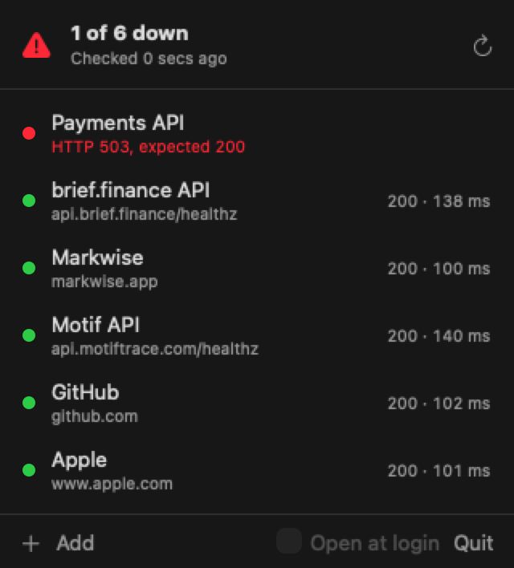

# Upbar

Is it up? A tiny macOS menu bar app that checks your URLs every minute and notifies you when one goes down.



- Shows a ✓ in the menu bar when everything is up, and a red ⚠ when something is down
- Sends a notification when an endpoint goes down and when it comes back
- Lets you set the status code you expect for each endpoint (200, 204, 301…)
- One Swift file, no dependencies, no account, no telemetry

## Install

```sh
curl -fsSL https://raw.githubusercontent.com/josephgoksu/upbar/main/install.sh | sh
```

This installs into `~/Applications`. No sudo, no admin password. macOS 14+, Apple Silicon or Intel.

<details>
<summary>Downloaded the zip in a browser instead?</summary>

Upbar isn't notarized yet, so macOS blocks zips downloaded through a browser. Right-click `Upbar.app` → **Open** → **Open**, once. The install script above avoids this.
</details>

Uninstall:

```sh
rm -rf ~/Applications/Upbar.app && defaults delete com.josephgoksu.upbar
```

## Use

| Do | How |
|---|---|
| Add a URL | **+ Add** (⌘N): enter a name, a URL, and the expected status |
| Edit or delete one | Right-click the row |
| Open it in the browser | Click the row |
| Check now | ⟳ (⌘R) |
| Start at login | The **Open at login** checkbox |

An endpoint counts as **down** after 2 failed checks in a row: a timeout (10s), a connection error, or any status other than the one you expect. Redirects aren't followed, so `301` means exactly 301.

## Build

Needs Xcode or the Command Line Tools (Swift 6).

| Command | What |
|---|---|
| `swift run` | Dev loop (no app bundle: notifications print to the terminal) |
| `swift test` | Tests |
| `./build.sh install` | Universal `Upbar.app` → `~/Applications`, then relaunches it |

Release: push a `v*` tag. CI tests, builds, and attaches `Upbar.zip` to a GitHub release, which is what `install.sh` downloads.

## License

MIT
