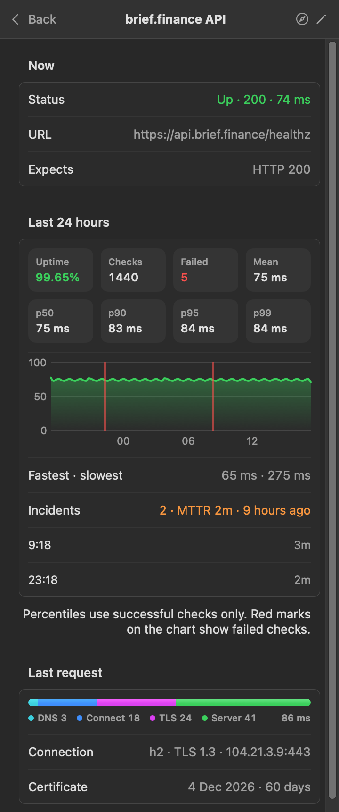

<p align="center"></p>

<h1 align="center">Upbar</h1>

<p align="center">Uptime checks in your macOS menu bar.</p>

<p align="center">
  <a href="https://github.com/josephgoksu/upbar/releases/latest"></a>
  <a href="https://github.com/josephgoksu/upbar/actions/workflows/ci.yml"></a>
  
  <a href="LICENSE"></a>
</p>

<p align="center">
  
  
</p>

## 1. General

Upbar monitors the HTTP endpoints that you add. It sends a notification when an endpoint goes down and when it is up again.

| Feature | Description |
|---|---|
| Menu bar icon | Shows the response times of the last 7 checks |
| Endpoint list | Groups the endpoints by website. Shows the last 30 checks of each endpoint. |
| Detail page | Uptime, failed checks, mean, p50, p90, p95, p99, fastest and slowest check, 24-hour chart, incidents and MTTR |
| Request trace | DNS, connect, TLS and server time, protocol, TLS version and IP address |
| Certificate | Shows the expiry date. Sends a notification 14 days before. |
| Events | Receives events from deploys, CI jobs and scripts. Refer to [section 8](#8-events). |
| Small | Two Swift files, no dependencies, approximately 20 MB of memory |
| Private | No data collection. Refer to [section 6](#6-privacy). |

## 2. Installation

Requirements: macOS 14 or later, Apple silicon or Intel. You do not need an administrator password.

### 2.1 Install with Terminal (recommended)

1. Open Terminal.
2. Type this command:

   ```sh
   curl -fsSL https://raw.githubusercontent.com/josephgoksu/upbar/main/install.sh | sh
   ```

3. Push the Return key.

Result: Upbar is in `~/Applications`. The Upbar icon shows in the menu bar. The script does not use `sudo`. It compares the download with a SHA-256 checksum.

### 2.2 Install from a browser download

1. Download `Upbar.zip` from the [latest release](https://github.com/josephgoksu/upbar/releases/latest).
2. Open `Upbar.zip`.
3. Move `Upbar.app` to the Applications folder.
4. Right-click `Upbar.app`, then select **Open**.
5. In the dialog box, click **Open**.

> [!NOTE]
> Do steps 4 and 5 one time only. Apple does not notarize Upbar at this time. Thus, macOS blocks the first start.

When Upbar starts for the first time, macOS asks to allow notifications. Click **Allow**.

## 3. Operation

Click the Upbar icon in the menu bar to open the window.

| Task | Procedure |
|---|---|
| Add an endpoint | Click **+ Add Endpoint** (⌘N). Type the URL. Optional: type a name and the expected status code (default 200). Click **Save**. |
| See the details | Click the endpoint. To go back, click **Back** or push Esc. |
| Open in the browser | On the detail page, click the compass icon. Alternatively, right-click the endpoint, then select **Open in Browser**. |
| Edit an endpoint | Move the pointer onto the endpoint, then click the pencil icon. Alternatively, right-click the endpoint, then select **Edit**. |
| Delete an endpoint | In the editor, click **Delete Endpoint**, then click **Click Again to Delete**. Alternatively, right-click the endpoint, then select **Delete**. |
| Fold a website | Click the name of the website. Click it again to show the endpoints. |
| Check all now | Click the arrow icon at the top right (⌘R). |
| Start at login | Click **⋯**, then select **Open at Login**. |
| Stop Upbar | Click **⋯**, then select **Quit Upbar**. |

> [!NOTE]
> - If the URL has no `http://` or `https://`, Upbar adds `https://`.
> - If you change the URL or the expected status code, Upbar deletes the check history. A new name keeps the history.
> - You cannot undo a delete.

## 4. Indications

| Indication | Meaning |
|---|---|
| 7 bars in the menu bar color | All endpoints are up. The height of a bar is the median response time of one check. |
| Orange bar in the menu bar | A check failed during that minute. No endpoint is down now. |
| Red bars and a number in the menu bar | The number of endpoints that are down |
| Gray dots in the menu bar | Upbar has not done 7 checks since it started. |
| Green ring and **All systems up** | All endpoints are up. |
| Red tint and **2 of 6 down** | 2 endpoints are down. The green part of the ring is the endpoints that are up. |
| **Offline** | The Mac has no network connection. Upbar stops the checks until the connection is available. |
| Green **2/2 up** at a website | All endpoints of the website are up. |
| Gray **1/2 up** at a website | Upbar has not completed the check of 1 endpoint. |
| Red **1 down** at a website | 1 endpoint is down. Upbar shows this website first. |
| Red dot and red text | The endpoint is down. The text shows the cause and the time since it went down. |
| Orange response time | The response time is more than 1 second. |
| Orange **Certificate expires in 9 days** | The TLS certificate expires in less than 14 days. |
| Red bar in the history | One check failed. |

## 5. How Upbar checks an endpoint

1. Every 60 seconds, Upbar sends a `HEAD` request to each endpoint.
2. If the status code is not the expected code, Upbar sends a `GET` request. It stops the request after the headers.
3. If the `GET` status code is not the expected code, the check fails.
4. After 2 failed checks in sequence, the endpoint is down. Upbar sends a notification.
5. After 1 successful check, a down endpoint is up. Upbar sends a notification.

Rules:

- Upbar does not follow redirects. A 301 response is status 301.
- A request fails after 10 seconds with no data, or after 15 seconds in total.
- A connection error is a failed check.
- If all endpoints on 2 or more websites fail with a connection error in the same check, Upbar ignores that check. The cause is the network of your Mac, not the endpoints. An HTTP error is always a failed check.
- Upbar stops the checks while the Mac is offline.

Statistics on the detail page:

| Item | Calculation |
|---|---|
| Uptime | Successful checks ÷ all checks in the last 24 hours |
| p50, p90, p95, p99 | Nearest-rank method, successful checks only |
| Incident | 2 or more failed checks in sequence, the same rule as the notification |
| MTTR | Mean duration of the incidents that ended |
| Last request | Phases of the last check. A **reused** connection shows only the server time. |

Resource use with 10 endpoints:

| Resource | Value |
|---|---|
| Memory | Approximately 20 MB |
| CPU | 0% between checks, approximately 0.2% on average |
| Network | Approximately 60 KB each minute |

To see the use of Upbar, click **⋯**. The menu shows the CPU use of Upbar in the last minute and its memory.

## 6. Privacy

- Upbar does not collect data. It sends requests only to the endpoints that you add.
- The list of endpoints is in the `com.josephgoksu.upbar` preferences.
- The check results of the last 24 hours are in `~/Library/Application Support/Upbar/history.plist`. Each result is a time and a response time.
- Upbar does not keep cookies, a cache or response bodies.
- Events go directly from the sender to your Mac. Upbar keeps them in memory only.
- The receiver token is in `~/Library/Application Support/Upbar/receiver-token`. Only your user can read it.

## 7. Troubleshooting

| Problem | Cause | Action |
|---|---|---|
| No notifications | Notifications for Upbar are off. | Open **System Settings > Notifications > Upbar**. Turn on **Allow notifications**. |
| macOS does not open Upbar. | You downloaded Upbar with a browser. | Do [section 2.2](#22-install-from-a-browser-download). |
| **HTTP 301** or **HTTP 302** | The endpoint sends a redirect. | Use the final URL, or set the expected status code to the redirect code. |
| An `http://` endpoint shows the `https://` status. | The site uses HSTS. | Use the `https://` URL. |
| **Open at Login** does not stay on. | macOS must approve the login item. | Open **System Settings > General > Login Items**. Turn on **Upbar**. |
| **Save** is not available. | The URL or the status code is not correct. | Read the red text. Correct the value. |
| The test command shows a connection error. | Events are off, or a firewall blocks port 4747. | Turn on events. Allow incoming connections for Upbar in **System Settings > Network > Firewall > Options**. |
| The test command with the Tailscale address fails on the same Mac. | Tailscale does not send traffic from a Mac to its own address. | On the same Mac, use `http://localhost:4747`. Other devices can use the Tailscale address. |
| Status 401 | The token is not correct. | Select **⋯ > Copy Test Command** again. |
| **Another app uses port 4747** | A second copy of Upbar, or a different app, uses the port. | Stop the other app. Upbar tries again every 5 seconds. |

## 8. Events

Upbar can receive events from deploys, CI jobs, scripts and servers. The events go directly to your Mac. No other server is necessary.

### 8.1 Turn on events

1. Click **Events**.
2. Click **Turn On Events**.

Result: Upbar listens on port 4747 and makes an access token. To stop, set **Receiving** to off.

> [!CAUTION]
> All devices that can connect to your Mac can send to port 4747. Upbar rejects each request without the correct token. Do not share the token.

### 8.2 Send an event

1. Click **⋯**, then select **Copy Test Command**.
2. Paste the command in Terminal, then push the Return key.

Result: The event shows in the **Events** list and as a notification.

Send an HTTP `POST` to port 4747 of your Mac. Use the `.local` name on the same network. Use the Tailscale address on a tailnet.

| Item | Header | JSON body |
|---|---|---|
| Token | `Authorization: Bearer <token>`, or `?token=<token>` in the URL | |
| Title | `Title` | `title` |
| Message | Plain-text body | `message` |
| Severity | `Tags` | `tags` |
| Link (opens on click) | `Click` | `click` or `url` |

| Tags or priority | Indication |
|---|---|
| `x`, `failure`, `failed`, `error`, `warning`, `rotating_light`, `red_circle`, or `Priority` 4 or 5 | Red cross |
| `white_check_mark`, `success`, `ok`, `tada`, `green_circle` | Green check mark |
| All other events | Blue bell |

```sh
curl -H "Authorization: Bearer $UPBAR_TOKEN" -H "Title: API deploy failed" -H "Tags: x" \
  -d "Health check timed out" http://my-mac.local:4747
```

Rules:

- Upbar accepts `POST` and `PUT` requests of 64 KB or less.
- Upbar keeps the last 100 events in memory. It deletes them when it stops.
- If your Mac is off or asleep, the sender gets a connection error. Upbar does not receive the event.
- To make a new token, select **⋯ > New Token**. The old token stops.

### 8.3 Connect Coolify

Upbar reads the Coolify fields `success`, `application_name`, `environment` and `deployment_url`. The Coolify server must reach your Mac. Use Tailscale on the server and on the Mac.

1. In the **Events** tab, find the Tailscale address, for example `http://100.83.110.12:4747`.
2. In Coolify, go to **Settings > Advanced > Allowed internal targets**.
3. Add the address of your Mac, for example `100.83.110.12`.
4. Click **Save changes**.
5. Go to **Notifications > Webhook**.
6. In **Webhook URL**, type `http://100.83.110.12:4747/?token=<token>`.
7. Select the events, for example **Deployment success** and **Deployment failure**.
8. Click **Enable**.
9. Click **Save changes**.
10. Click **Send Test**.

Result: A failed deploy shows a red cross. Click the event to open the deployment in Coolify.

> [!NOTE]
> Coolify blocks private addresses until you add them in step 3. To get the token, select **⋯ > Copy Test Command**. The token follows `Bearer`.

## 9. Removal

1. Stop Upbar.
2. In Terminal, type these commands. The second and third commands are optional. They delete the endpoints and the history.

   ```sh
   rm -rf ~/Applications/Upbar.app
   defaults delete com.josephgoksu.upbar
   rm -rf ~/Library/Application\ Support/Upbar
   ```

## 10. Build from the source code

You must have Xcode 16 or the Command Line Tools with Swift 6.

| Command | Result |
|---|---|
| `swift run` | Starts Upbar without an app bundle. Notifications show in Terminal. |
| `swift test` | Runs the tests. |
| `./build.sh` | Builds `dist/Upbar.app` and `dist/Upbar.zip` for Apple silicon and Intel. |
| `./build.sh install` | Builds Upbar, installs it in `~/Applications` and starts it. |
| `swift scripts/icon.swift` | Draws the app icon and the social preview. |

| Path | Content |
|---|---|
| `Sources/Upbar/Upbar.swift` | Checks, statistics and the window |
| `Sources/Upbar/Events.swift` | The event receiver and the Events list |
| `Tests/UpbarTests/` | Tests |
| `Resources/` | `Info.plist` and the app icon |

## 11. Contribution, security and license

- [CONTRIBUTING.md](CONTRIBUTING.md), [SECURITY.md](SECURITY.md), [CHANGELOG.md](CHANGELOG.md), [docs/releasing.md](docs/releasing.md)
- Upbar has the [MIT license](LICENSE).
